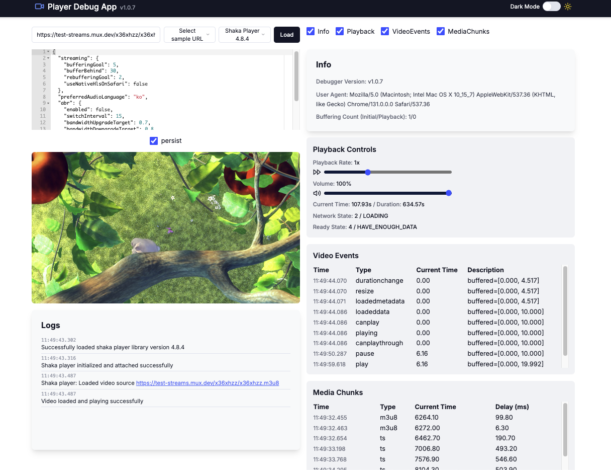

## Player Debug App



### Overview

`Player Debug App` is a platform designed for testing and debugging various streaming playback scenarios using multiple video player libraries. It offers the following features:

- Support for various player libraries, including **HLS.js** and **Shaka Player**.
- Real-time observation and logging of player states, such as **buffer**, **playback state**, and **network state**.
- Load and debug streams using sample URLs or custom URLs.
- Save and reuse player configurations.

---

### Key Features

1. **Player Library Support**

   - Support for a variety of libraries, including HLS.js and Shaka Player.

2. **Playback Debugging**

   - Real-time logging of playback-related data, including network and buffer states.
   - Visualization of chunk loading times and debugging data.

3. **User Settings and Data Persistence**

   - Save settings and URLs to local storage.
   - Reuse previously configured player settings.

4. **Debugging Interface**
   - Various debugging panels:
     - **InfoPanel**: Displays network and buffer states.
     - **LogsPanel**: Records debugging logs.
     - **MediaChunksPanel**: Logs chunk loading times and file types.
       - Visualizes manifest and segment responses in a table format. Currently supports only HLS.js.

---

### Tech Stack

- **Next.js**
- **React**
- **Tailwind CSS**
- **TypeScript**
- **Recharts**
- **Radix UI**

---

### Code Structure

```
src
 ┣ app
 ┃ ┣ players
 ┃ ┃ ┣ hlsjs
 ┃ ┃ ┃ ┗ customLoader.ts
 ┃ ┃ ┣ shaka
 ┃ ┃ ┣ .DS_Store
 ┃ ┃ ┣ config.ts
 ┃ ┃ ┗ event.ts
 ┃ ┣ .DS_Store
 ┃ ┣ favicon.ico
 ┃ ┣ globals.css
 ┃ ┣ layout.tsx
 ┃ ┗ page.tsx
 ┣ components
 ┃ ┣ config
 ┃ ┃ ┣ ConfigEditor.tsx
 ┃ ┃ ┗ configService.ts
 ┃ ┣ library
 ┃ ┃ ┣ LibrarySelector.tsx
 ┃ ┃ ┗ libraryLoader.ts
 ┃ ┣ panels
 ┃ ┃ ┣ InfoPanels.tsx
 ┃ ┃ ┣ LogsPanel.tsx
 ┃ ┃ ┣ MediaChunkPanel.tsx
 ┃ ┃ ┣ PlaybackPanel.tsx
 ┃ ┃ ┗ VideoEventsPanel.tsx
 ┃ ┣ ui
 ┃ ┃ ┣ alert.tsx
 ┃ ┃ ┣ button.tsx
 ┃ ┃ ┣ checkbox.tsx
 ┃ ┃ ┣ input.tsx
 ┃ ┃ ┣ select.tsx
 ┃ ┃ ┣ slider.tsx
 ┃ ┃ ┣ switch.tsx
 ┃ ┃ ┗ tabs.tsx
 ┃ ┣ util
 ┃ ┃ ┣ LogService.ts
 ┃ ┃ ┗ utils.ts
 ┃ ┣ .DS_Store
 ┃ ┣ PlayerDebugApp.tsx
 ┃ ┗ mediaChunkLogger.ts
 ┣ hooks
 ┃ ┣ useLiveMedia.ts
 ┃ ┣ useVideoEvent.ts
 ┃ ┗ useVideoPlayer.ts
 ┣ lib
 ┃ ┗ utils.ts
 ┗ .DS_Store
```

### CustomLoader Overview

The `customLoader` is a class implemented for customizing HTTP requests and responses in HLS.js. Its primary features include:

1. **Chunk Data Loading**

   - Sends HTTP requests and logs loaded data information.
   - Tracks request start and completion times to calculate loading delay.

2. **Debugging Information**

   - Calls `addChunkInfo` to log chunk details.
   - Determines file type (`type`) based on file extensions.

3. **Error Handling**

   - Handles various errors, including network errors, HTTP status errors, and timeouts.

4. **Methods Provided**
   - `load`: Initiates requests and calls success or failure callbacks.
   - `abort`: Aborts ongoing requests.
   - `destroy`: Cleans up loader instances and cancels requests.

#### Key Code

```typescript
load(context: any, config: any, callbacks: any) {
  const uri = context.url;
  this.request = new XMLHttpRequest();

  this.request.open("GET", uri, true);
  this.request.responseType = context.responseType || "text";

  // Record loading start time
  this.stats.loading.start = performance.now();

  this.request.onload = () => {
    if (this.request!.status >= 200 && this.request!.status < 300) {
      const data = this.request!.response;
      const delay = (performance.now() - this.stats.loading.start).toFixed(2);

      addChunkInfo({
        time: getTimestamp(),
        type: uri.split(".").pop() || "unknown", // Handles query strings for low-latency cases
        currentTime: performance.now().toFixed(2),
        delay,
      });

      callbacks.onSuccess({ url: uri, data }, this.stats, context);
    } else {
      callbacks.onError({ code: this.request!.status }, context, this.request, this.stats);
    }
  };

  this.request.send();
}
```

## Installation and Running

### Install Dependencies

```bash
npm install
```

### Start Development Server

```bash
npm run dev
```
